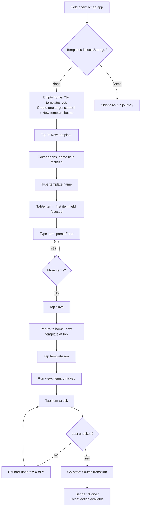

# UX Design Specification — bmad

**Author:** guy
**Date:** 2026-04-29

---

## Executive Summary

### Project Vision

**bmad** is a browser-based checklist app for people who run the same multi-step procedure repeatedly — packing, weekly routines, deploy runbooks, recipes, SOPs. The wedge is a different optimization target than generic todo apps: **completion is preserved state, not deletion**; **templates are first-class**; **copy-means-fork** for sharing. v1 is a client-only SPA on localStorage with no auth; Growth adds a public template registry. The emotional payoff is the **go-state** — a fully-ticked run that visibly reads as *done*.

### Target Users

- **Maya — the re-doer (MVP, primary).** PM, mid-30s, runs the same procedures weekly/monthly (packing, grocery, D&D setup). One-handed in real-world contexts (kitchen, suitcase). Currently bouncing between Apple Reminders (loses context on tick) and Google Docs (edits in place, loses track). Tech-comfortable but not power-user.
- **Sam — the publisher (Growth).** DevOps engineer, has a deploy runbook teammates keep asking for. Wants a place where colleagues can grab-and-use without him re-explaining.
- **Pat — the consumer (Growth).** New manager, no SOP-writing experience, wants someone else's "running a 1:1" template instead of inventing her own.

### Key Design Challenges

- **The go-state must carry the wedge.** FR12 isn't just rendered state — it's the emotional payoff. Motion, color, and copy all need to land. Under-investment here flattens the entire differentiation.
- **Mobile-first run view, one-thumb operation.** Hot path is ticking items mid-procedure on a phone. ≥44px touch targets, run view excellent at small viewport before desktop polish.
- **Honest empty-state and error narration (Journey 1B).** Five distinguishable states need distinct copy: no-templates-yet vs. wrong-browser vs. quota-full vs. storage-cleared vs. storage-disabled. Generic errors break trust here.
- **Mental-model clarity: template → run → tick → archive/reset.** Four nouns must feel obvious. Reset (wipe-in-place) vs. Archive (preserved record, Growth) are easy to confuse — labels and placement need to be unambiguous from MVP onward.
- **No signup wall, sub-90-second first run.** The first-time user must reach the go-state without docs.

### Design Opportunities

- **Make the go-state the signature moment.** Distinctive motion + color + copy on completion. This is the screenshot people share.
- **Surface the re-run loop on second visit.** The "aha" is realizing you don't have to rebuild — the home screen on visit #2 should make re-running the most-used template a one-tap path (success metric: ≤2 taps from home).
- **Use empty-state copy as a trust-building voice.** Honest, specific messaging when things go wrong (cleared storage, different browser) turns a churn moment into a mental-model moment.
- **Visible-completion as a visual language.** Ticked-but-still-there is the product's core idea — design tokens for ticked items should feel earned and persistent, not greyed-out and forgotten.

## Core User Experience

### Defining Experience

The product has **two core actions** that define everything:

1. **Tick an item in an active run** — the hottest path, executed many times per session, often one-handed mid-procedure on a phone. Must be instantaneous, undoable, and visibly persistent.
2. **Re-instantiate a run from a template** — the wedge moment. Realizing "I don't have to rebuild this" is the *aha*. Target ≤2 taps from home for the most-used template.

Everything else (authoring, navigation, sharing) is in service of these two verbs landing cleanly.

### Platform Strategy

- **Web SPA, mobile-web first.** Run view designed for small viewport and one-thumb interaction; template editor allowed to be desktop-leaning. No native app, no install required for v1 (PWA install is Growth).
- **Touch-first on the run view, keyboard-equal on the editor.** Tick targets ≥44×44 px. Full keyboard operability across the app from MVP (FR44 / NFR17).
- **Offline-by-default once loaded.** v1 has no backend; the app must treat the network as absent. localStorage is the source of truth. Quota and unavailability are first-class UI states.
- **Browser matrix:** latest two stable Chrome / Safari / Firefox / Edge desktop + mobile, plus Samsung Internet on Android. IE and pre-Chromium-100 / pre-WebKit-16 explicitly out.

### Effortless Interactions

- **Ticking** — single tap, no confirm, instant visual response, optimistic state. No mental cost.
- **Starting a run** — one tap on a template card. No "configure run" dialog, no naming, no dating. The friction Maya hits in Reminders/Docs is exactly this — kill it.
- **Resuming a run** — opening the app while a run is active drops you straight into it. No menu navigation back to where you were.
- **Creating the first template** — type the name, type items as fast as you can think them, save. No category picker, no template-of-template wizard, no signup wall.
- **Reset for next time** — one tap inside the finished go-state, with a soft confirm. Re-running tomorrow shouldn't require thinking about "where do I find that?"

### Critical Success Moments

- **First-run go-state.** Maya's first time arriving at "all done." If this moment doesn't read as *finished and earned*, the wedge collapses into a generic checkbox UI. Disproportionate polish budget belongs here.
- **First re-run.** Maya opens the app a week later, sees her template, taps Run, and gets a fresh checklist with her items intact. The realization that nothing was rebuilt is the retention event.
- **Empty-state on a different browser (Journey 1B).** The moment Maya opens the app in Arc and sees nothing. Generic "No data" copy here churns her permanently. Honest, specific narration retains her.
- **Storage failure (quota / disabled).** Distinguishable from empty — must read as "the app knows what's wrong" not "the app is broken."

### Experience Principles

1. **Completion is preserved state, not deletion.** Ticked items stay visible, tonally distinct but not dimmed-into-irrelevance. The done column carries the satisfaction.
2. **The go-state is the destination.** Every flow is designed as if arriving there is the goal. Motion, color, and copy converge on that moment.
3. **One thumb on the run view.** Small viewport is the design baseline, not a responsive fallback. Anything that doesn't work for Maya in her kitchen doesn't work.
4. **Honest narration over generic chrome.** Empty states, error states, and edge cases speak in specifics ("Templates are stored on this browser — your Safari templates are still there"). Trust is built at the edges.

## Desired Emotional Response

### Primary Emotional Goals

The dominant feeling is **earned satisfaction** — the calm, slightly smug closure of having visibly finished something you set out to do. Not dopamine-burst delight, not gamified celebration. The feeling of looking at a packed suitcase and thinking *good, that's done.* The product's tonal North Star is *competence-affirming*, not *reward-dispensing*.

Secondary: **trust** in the app holding state without surprise (templates persist, ticks persist, nothing vanishes), and **lightness** — the app feels cheap to open, cheap to use, doesn't ask anything of you.

### Emotional Journey Mapping

- **First-touch (landing).** *Curiosity, low resistance.* No signup wall, no marketing pitch on the home screen. The app gets out of the way. User feels: "this is just a thing I can use."
- **Authoring first template.** *Flow.* No friction between thought and item. User feels: "I'm just typing."
- **First run, mid-procedure.** *Focused control.* Ticking is responsive, the list reads at a glance, what's left is obvious. User feels: "I'm on top of this."
- **Reaching the go-state.** *Quiet pride.* The wedge moment. Visibly distinct, slightly celebratory but not loud. User feels: "done."
- **Reset and re-run (the *aha*).** *Recognition.* "Oh — I don't have to rebuild." Not surprise-delight; more the satisfaction of a tool that *gets it.* User feels: "this remembers how I work."
- **Returning days later.** *Familiarity.* Templates exactly where they were, last-used surfaced. User feels: "still here, still mine."
- **When something goes wrong (cleared storage, quota).** *Informed, not abandoned.* The app explains, in specifics, what happened and what to do. User feels: "the app knows."

### Micro-Emotions

The critical ones for this product:

- **Confidence** (high stakes) — Maya is mid-procedure with greasy thumbs. Every tick must register without doubt. Hesitation here is fatal.
- **Trust** (high stakes) — data lives in localStorage. Any whiff of "did I lose my templates?" loses the user. Honesty at the edges builds it.
- **Accomplishment** (high stakes) — the go-state. The feeling has to *land*; if it reads as a dim grey "100% complete" bar, the wedge dies.
- **Lightness** (medium) — the app is small, the bundle is tight, nothing feels heavy. Don't undermine this with splash screens or onboarding modals.

To avoid: **anxiety** (about losing data), **frustration** (about needing to recreate), **gamification fatigue** (no streaks, no badges, no nudges), **abandonment** (a generic "Something went wrong").

### Design Implications

- **Earned satisfaction → understated celebration.** The go-state uses motion and color, but tastefully. Think "kitchen timer ding," not "slot machine win." A single, well-judged transition. No confetti. (Optional: a tiny sound, off by default.)
- **Trust → honest narration.** Empty states and errors speak in specifics, name the cause, name the fix. Never "Something went wrong."
- **Confidence on tick → instant optimistic state, no flicker.** Tap-to-tick lands in <16ms perceived. Visible, slightly weighty checked state — feels like flipping a real switch, not toggling a styled checkbox.
- **Lightness → no chrome bloat.** Minimal nav, no persistent header taking vertical space on mobile, no marketing strip. The app should feel like a single page that does its job.
- **Familiarity on return → last-used template prominent on home.** State is preserved and surfaced, not buried.
- **No dopamine economy.** No streaks, no "you've completed 7 runs!" counters, no notifications begging you back. Retention is earned by being useful, not by being sticky.

### Emotional Design Principles

1. **Tone: quietly competent, never cheerful.** The app is a tool, not a friend. No exclamation marks, no "Yay!", no anthropomorphic copy. *"All packed."* not *"Woohoo, you packed everything!"*
2. **Celebrate completion exactly once, exactly enough.** The go-state is the only moment that visibly celebrates. Everywhere else, restraint.
3. **Honesty is a feature.** When state is empty, missing, or broken, say so plainly and specifically. Honesty at the edges is what makes the satisfying middle feel earned.
4. **Respect the user's attention.** No nudges, no gamification, no notifications. The product earns return visits by being good to come back to.

## UX Pattern Analysis & Inspiration

### Inspiring Products Analysis

Four products worth pulling from, plus one moment from a fifth:

- **Things 3 (Cultured Code).** The tonal benchmark for *quietly competent* productivity. Restrained motion (a single, well-judged checkmark animation), typographic discipline, no exclamation marks, no badges, no streaks. Exactly the register bmad needs. Authoring flows feel like writing, not configuring. Mobile and desktop both feel native to their viewport.
- **Linear.** Speed-as-a-feature: keyboard-first, low chrome, quick capture. Empty states are written by humans, not boilerplate. Animation is tasteful and short. Linear's home view (last-touched, current focus surfaced) is a model for bmad's "last-used template prominent" goal.
- **Workflowy / Bear.** The authoring-flow benchmark. Items appear at the speed of thought; no field labels, no save buttons fighting you. Hit Enter, type next item, repeat. Maya typing a packing list at 7:14 AM should feel exactly like this.
- **Stripe Checkout (and Stripe error UX broadly).** The honest-narration benchmark. When something is wrong, Stripe tells you *what* and *why* in one sentence, no generic "Something went wrong." This is the tonal model for bmad's localStorage failure states.
- **Headspace's session-end screen** *(single moment, not whole product).* A quiet "you finished" moment with a single word and a held beat. Good reference for the go-state — celebration via *restraint*, not *flourish*.

### Transferable UX Patterns

- **Inline keyboard-driven authoring (Linear, Workflowy).** Tap into a template, items appear as a focused list, hit Enter to add the next, no save button, no field chrome. Eliminates the "I have to configure this list" friction.
- **Restrained completion animation (Things 3, Headspace).** A single transition — color shift, slight scale, optional held haptic on mobile — and that's it. No confetti, no sound by default. The go-state arrives, holds, and stays.
- **Last-action-surfaced home (Linear).** Home screen leads with the user's most recent or most-used template, not a chronological feed. Maya's "re-run in ≤2 taps" goal lives here.
- **Honest, specific error/empty copy (Stripe, Linear).** Each state names the cause and the next step in one short sentence. Distinguishable variants for distinguishable causes (no-data-yet vs. wrong-browser vs. quota-full vs. cleared vs. disabled).
- **Optimistic tap-to-tick (Things 3, every native iOS toggle).** The tick lands instantly, no spinner, no flicker. State is local; persistence is async behind the visible UI.
- **One-thumb run view = bottom-anchored primary actions.** Reset / archive / done buttons sit in the thumb-reachable lower half. Never relegate completion to a top-right pin.
- **Card-as-template metaphor (Notion templates, Apple Shortcuts gallery).** Templates appear as tappable cards; Run is the primary action on the card; secondary actions (rename, edit, delete) live behind a single tap.

### Anti-Patterns to Avoid

- **Todoist / Apple Reminders' "tick = remove" model.** Directly counter to bmad's wedge. Visible-completion is non-negotiable.
- **Duolingo-style gamification.** Streaks, XP bars, "3 days in a row!" nudges, push notifications. Wrong dopamine economy entirely. The product sells *competence*, not *engagement*.
- **Confetti / "Yay you did it!" celebration on completion.** Wrong tonality. Earnest restraint > performative delight.
- **Onboarding modals, marketing splash screens, "let's get started!" wizards.** The PRD requires sub-90-second first-run with no docs. Any modal between landing and first tick is a wedge-killer.
- **Generic "Something went wrong" errors.** Trust-killer. Each failure mode gets a specific, distinguishable message.
- **Persistent top header that eats vertical space on mobile.** Run view is for one-thumb scrolling on small viewports — every pixel of chrome is an item Maya can't see.
- **"Are you sure?" modal on every destructive action.** Reset and Delete deserve a *soft* confirm at most (undo toast, not a blocking dialog). Trust the user.
- **Notion-style configurability.** Categories, properties, custom fields, views. The product is a checklist app, not a database. Resist.

### Design Inspiration Strategy

**Adopt directly:**
- Things 3's tonal restraint and motion budget (the entire emotional voice).
- Linear's keyboard-first authoring + last-action-surfaced home.
- Stripe's honest, specific error/empty-state copy discipline.
- Things 3's optimistic tap-to-tick interaction.

**Adapt:**
- Headspace's "single quiet moment" pattern → bmad's go-state. Hold the moment longer than feels comfortable.
- Linear's empty states → bmad's *five* distinguishable storage-state messages. Same voice, more variants.
- Workflowy's inline item authoring → bmad's template editor, but with explicit save (since templates persist; runs are ephemeral).

**Avoid (explicit list):**
- Todoist/Reminders' tick-removes-item.
- Duolingo's gamification and notification economy.
- Notion's configurability bloat.
- Splash/onboarding/welcome modals.
- Generic error copy.
- Confetti on completion.

## Design System Foundation

### Design System Choice

**Custom-light, with Tailwind CSS as the styling primitive and Radix UI primitives for accessible interactive components.** No third-party visual component library (no MUI, no Ant Design, no Chakra).

The visible component surface for this product is small — perhaps a dozen distinct components total: template card, checklist item, button, text input, sheet/modal, toast, empty state, error state, the go-state celebration, header, and a couple of layout shells. Building those in-house is faster than fighting a large library to look right.

### Rationale for Selection

- **NFR4 (≤150 KB gzipped, CI-gated) is the binding constraint.** Material UI alone ships ~50–80 KB minified before app code; Ant Design is heavier; Chakra plus Emotion runtime eats further. A custom system on Tailwind (~10 KB CSS, no runtime) with Radix headless primitives (~5 KB per primitive, tree-shaken) leaves room for app code and the framework. Most established systems would put the wedge in tension with the bundle on day one.
- **The tonal goal is too specific to inherit.** "Things 3 restraint" is a deliberate aesthetic — typographic discipline, generous whitespace, motion held back, single-celebration-moment-on-completion. Material's loud defaults, Ant's enterprise table-density, and Chakra's bright neutrals all fight that voice. The custom path is the wedge path.
- **Component surface is tiny.** ~10–12 components for MVP, maybe 18–20 by Growth. The library overhead-vs-build ratio inverts here: building is cheaper.
- **Solo developer / one cognitive overhead.** Tailwind + Radix is one mental model (utilities + headless primitives + tokens). No theme override gymnastics, no debugging emotion-vs-styled-components priority quirks, no learning a library's component-prop API.
- **Accessibility floor lands cheaply.** Radix primitives ship correct ARIA, focus management, keyboard handling for the few interactive components that need it (sheet/modal, toggle, dropdown). NFR17 / FR44 (keyboard + visible focus) get most of the way there for free; NFR19 (full WCAG AA in Growth) becomes incremental, not a rewrite.
- **Framework-portable.** Tokens as CSS custom properties + Tailwind utilities + Radix-style primitives compose in any modern SPA framework. The architecture's framework choice (React/Preact/Solid/Svelte/Vanilla) is preserved without lock-in to a component library that only ships React bindings.

### Implementation Approach

- **Tokens as CSS custom properties.** Color, spacing, typography, motion, radius, shadow defined in `:root` (with a future-proofed dark-mode-via-`[data-theme="dark"]` even though dark mode is Vision-tier). Tokens are the source of truth; Tailwind's config consumes them.
- **Tailwind config consuming tokens.** Extend Tailwind's theme to reference the CSS variables, not hard-coded hex values. This keeps utilities semantic-by-token and dark-mode-ready without a Tailwind theme rewrite.
- **Radix primitives wrapped, not used raw.** Each Radix primitive (Dialog, Toast, Toggle, Dropdown, AlertDialog) is wrapped once in a project component (`<Sheet>`, `<UndoToast>`) so styling and behavior are uniform across the app. App code never touches Radix directly.
- **In-house components live in `components/ui/`.** Flat, no atomic-design folder taxonomy. ~12 files for MVP. Each component owns its styles via Tailwind utilities and tokens.
- **No CSS-in-JS runtime.** Zero-runtime styling preserves bundle and TTI budgets.
- **Motion via CSS transitions and `prefers-reduced-motion` from day one.** No animation library in MVP. Framer Motion or similar is deferred unless the go-state demands it (it likely doesn't — it's a single transition, not orchestrated motion).
- **Iconography:** Lucide or Phosphor (tree-shaken SVGs). Both ship per-icon — no full-library penalty.

### Customization Strategy

- **Token-first overrides.** All visual change happens through token edits, never component-internal style edits. Changing the go-state green is a one-line token change, app-wide.
- **Component variants minimal.** Resist the urge to add `<Button variant="ghost-pill-large">` configurability. Two or three variants per component, max. Variants beyond that signal we should be writing a new component or accepting the friction.
- **No theme-switching infrastructure in MVP.** Light theme only. Dark mode tokens are *defined* in CSS custom properties under a `[data-theme]` attribute even in MVP, so Growth can flip a switch without a refactor — but no UI to toggle until then.
- **The go-state is bespoke.** Reuse tokens for color and motion timing, but build the go-state as a single dedicated component, not a Button-with-variant. Treat it as the brand surface.
- **Document tokens, not components, in this spec.** A short token table (color, type scale, spacing, motion) is the source of truth. Component documentation lives in code (Storybook or similar — defer the tooling decision).

## 2. Core User Experience

### 2.1 Defining Experience

**The defining experience is the *re-run loop*: open the app → tap a saved template → tick through items mid-procedure → arrive at the go-state.**

Compressed to one sentence the user would say to a friend: *"It's the checklist app where you save a list once, then run it as many times as you need to and you can see when it's done."*

If we get this single end-to-end loop perfectly right — fast to start, satisfying to tick, visibly done at the end — every other capability (authoring, archive, sharing) is in service of feeding that loop. If we get this wrong, no amount of polish elsewhere recovers the wedge.

### 2.2 User Mental Model

**How users currently solve this:**

- **Apple Reminders / Todoist:** make a list, tick items, watch them disappear, lose the list, recreate it next time.
- **Google Docs / Notes:** write a list once, edit-in-place every time, lose track of state across sessions, copy-paste to start fresh.
- **Paper / printout:** print a packing list, cross items off with a pen, throw it away, reprint next month.
- **Memory:** wing it, forget the toothbrush.

The shared pain point: *the list and the act-of-doing-the-list are conflated.* Existing tools treat completion as deletion (Reminders/Todoist) or treat the list as a single mutable artifact (Docs). Neither model supports "this list is a thing I will run repeatedly, and each run has its own state."

**The mental model bmad is teaching:**

The user must internalize a **two-noun separation**: a **template** (the procedure, persistent) and a **run** (one execution of it, ephemeral by default). This is the *one* concept the user has to learn. Everything else (tick, reset, archive) maps onto familiar metaphors.

The metaphor that lands fastest is probably **recipe → meal**, or **playlist → play**, or — for a technical user — **class → instance**. The product UI doesn't need to explain this; it needs to *demonstrate* it through the labels and the flow. "Run" as a button label is doing real conceptual work: it's a verb that implies a fresh, contained execution distinct from the source.

**Where users are likely to get confused:**

- **First-time confusion: "where did my list go?"** After saving a template and starting a run, the user might worry their template was consumed. Mitigation: the template list view is the home; runs are clearly *spawned from* a template card and the template stays visibly intact.
- **Reset vs. Delete confusion.** "Reset this run" must read as *clear the ticks, keep the template*, not *delete everything*. Label it precisely; never just say "Clear."
- **"Why is the ticked item still there?"** First-time users coming from Reminders may expect items to vanish on tick. Mitigation: the ticked-but-visible state is *visually distinctive enough* that the user reads it as "this is done" not "this didn't work." Strikethrough alone is too ambiguous; combine with a clear filled-checkbox + slight color shift + retained position.
- **One run per template (FR16).** Starting a new run while one is active: the system should silently replace, not prompt. The user's mental model is "I'm running my packing list" — singular. There is no need to surface concurrent-run UI complexity.

### 2.3 Success Criteria

The defining experience succeeds when:

- **Time-to-tick from cold open ≤ 3 seconds.** User opens the app, sees their templates, taps one, sees an unticked run — under three seconds, no spinner.
- **Time-to-go-state on a 10-item list ≤ the time it takes to do the procedure plus zero overhead.** The app adds no friction beyond the ticking itself. Maya's hands do the procedure; her thumb taps. The app keeps up.
- **Re-run feels like opening a fresh page, not duplicating a list.** No "duplicate template" flow, no "are you sure you want to overwrite the previous run." Tap Run, get a clean slate, the template is untouched.
- **The go-state is unmistakable.** Within 100ms of the last tick, the screen visibly *changes state* — color, layout shift, copy. There is no ambiguity about whether the procedure is finished. A user across the room can tell the run is done.
- **No documentation needed.** Maya, who has never seen the app, can complete the loop without reading anything. The labels and flow carry the model.
- **Returning user reaches Run in ≤ 2 taps from cold open.** Home loads → tap most-used template → tap Run. (Possibly compressed to 1 tap if the home surfaces a "Re-run [last template]" affordance.)

### 2.4 Novel vs. Established Patterns

bmad is mostly **familiar patterns recombined**, with one deliberate departure.

**Established (no education required):**
- Tap-to-tick on a checklist. Universal. Every checklist app since the iPhone has done this.
- A list of cards as a home view. Familiar from any productivity app.
- Tap a card to open detail. Universal.
- An undo toast on destructive action. Familiar from Gmail, Linear, Slack.

**The one deliberate departure: ticked items remain visible.**

This is the wedge, and it *is* novel relative to user expectation set by Reminders / Todoist / TickTick. The risk is that a first-time user reads a ticked-but-visible item as a bug. Mitigation:
- **Visual distinctiveness of the ticked state must read as "done," not "broken."** A filled, satisfying check box (not an empty one with strikethrough). A subtle but clear color shift toward the go-state palette. Strikethrough optional and secondary. Retained position in list (not reordered to bottom).
- **The first run is *the* education moment.** The user ticks the first item, sees it stay, and either accepts the model or doesn't. If they accept it, the rest of the app makes sense. There's no copy-based onboarding for this — the *interaction* teaches.
- **The go-state is the proof.** Reaching the go-state and seeing the *whole list* visibly complete (not an empty screen) retroactively explains why ticked items stayed.

**Familiar metaphors to lean on:**
- "Run" as a verb is borrowed from devops (run a deploy, run a test) but lands for non-technical users via cooking ("running a recipe") and routines.
- "Template" is universally understood as "a thing you copy from."
- "Reset" is borrowed from games and devices — a clean, unambiguous word.

### 2.5 Experience Mechanics

End-to-end mechanics for the defining experience, broken into four phases:

**1. Initiation — opening a run from a template.**

- User opens the app. Home view loads in <1.5s (NFR1) showing template cards in a single scrollable column on mobile, grid on desktop.
- The most-recently-used template (or the only template, on first run) sits at the top. Card surface is large enough to tap-target the whole card, not just a button.
- Tap on card → opens template detail view *or* directly starts a run. **Decision point** (revisit in component-strategy step): tap-anywhere-on-card = Run, separate "edit" affordance for authoring? Or card → detail view, then explicit Run button? Lean toward **tap = Run, long-press / overflow menu = edit**, because Run is the dominant verb. Maya pulls out her phone *to run* her list, not to edit it.
- When a run starts, the screen transitions to the run view. Items appear unticked, in the order they were authored. No naming dialog, no "start run?" confirmation.

**2. Interaction — ticking items mid-procedure.**

- Each item is a tappable row. Touch target ≥44×44 px. The whole row is tappable, not just the checkbox icon.
- Tap → optimistic state change in <16ms perceived. Checkbox fills, item shifts to ticked styling (color, weight, optional subtle scale), persistence to localStorage happens async after the visual change.
- Tap a ticked item → unticks it. No confirm. Same instant feedback in reverse.
- Items remain in their authored order, ticked or unticked. No reordering, no fade-to-bottom, no greying-out into invisibility.
- Scroll persists tick state. Closing the browser tab and reopening persists tick state (FR18, NFR6).
- A subtle but constant visual signal at the top of the run view: **how many ticked / how many total**, e.g. "7 of 12." Not a progress bar (too gamified); a small number reading. Maya can see at a glance how close she is.

**3. Feedback — knowing it's working.**

- Every tap responds visibly within one frame. No spinners, no loading states, no async perceived latency.
- The "X of Y" count updates live with each tick.
- If a tick fails to persist (storage quota, disabled), an explicit error appears within 200ms. No silent failures, no eventually-consistent surprises.
- If the user navigates away mid-run (back to template list, edits a different template), tick state is preserved (FR13). Returning to the run shows it exactly as left.

**4. Completion — reaching the go-state.**

- The moment the *last* unticked item is ticked, the run transitions to the **go-state**.
- Transition mechanics: a single, ~400–600ms held animation. The list does not vanish or collapse. Instead:
  - Background color transitions from neutral to the go-state palette (a confident green, contrast-checked at 4.5:1 per NFR18).
  - A go-state badge or banner appears at the top of the list, displacing the "X of Y" counter. Copy is short and grounded — *"Done."* or *"All items checked."* Not *"Yay!"* or *"You did it!"*
  - The full list of ticked items remains visible below, unchanged. The run is *complete and visible*, not closed-out and hidden.
  - Optional haptic on mobile (a single firm tick, not a buzz pattern).
  - Optional sound, default off.
- Two primary actions appear in the thumb-reachable lower half of the screen: **Reset** (clear ticks, keep template, ready for next run) and — in Growth — **Archive** (save this run as a record, then reset).
- The user can also leave the screen entirely (back to home, navigate to another template) without resetting. The completed run remains in its go-state until explicitly reset or archived.
- Re-opening the same template later, with its run in go-state, lands the user back on the go-state. The user may run again by hitting Reset (then it's an unticked run from the template again) or starting fresh from the template card.

**Decision point flagged for later steps:**
- **The go-state copy.** *"Done."* is one option. *"All set."* / *"Complete."* / *"All packed."* (template-name aware?) are others. Template-aware copy is delightful but adds complexity. Default to a neutral *"Done."* unless the template carries a custom completion-message field (Vision-tier).

## Visual Design Foundation

### Color System

**Strategy: warm-neutral paper base, single restrained accent, bespoke go-state palette.**

The product spends 95% of its time in *neutral* visual territory — template list, run view with mixed tick state, editor. Color should recede so the user's content (their items) is the visual center. The go-state breaks that neutrality decisively: it's the only place color shouts.

**Token table — proposed:**

| Token | Light value | Role |
|---|---|---|
| `--bg-canvas` | `#FAF8F4` | Page background — warm off-white, paper feel, not pure white |
| `--bg-surface` | `#FFFFFF` | Cards, sheets, elevated surfaces |
| `--bg-surface-sunken` | `#F2EFE9` | Pressed states, secondary fills |
| `--text-primary` | `#1F2329` | Body text, near-black, not pure black |
| `--text-secondary` | `#5A6068` | Metadata, counts, timestamps |
| `--text-tertiary` | `#8A9098` | Placeholder, hints, disabled |
| `--border` | `#E5E1D9` | Card outlines, dividers — warm-tinged grey |
| `--border-strong` | `#C8C2B6` | Emphasized borders, focus rings (paired with accent) |
| `--accent` | `#2E5E5C` | Single interactive accent — deep muted teal. Buttons, active state, focus ring |
| `--accent-hover` | `#244B49` | Hover/pressed for accent |
| `--accent-bg-soft` | `#E8EFEE` | Tinted backgrounds, selected rows |
| `--go-state-bg` | `#1E5A3D` | Background of completed run — confident forest green, contrast-checked |
| `--go-state-fg` | `#F5FBF7` | Text on go-state |
| `--go-state-accent` | `#5BBE83` | Highlight, badge fill on go-state |
| `--ticked-bg` | `#EFF4ED` | Subtle wash on ticked-but-not-yet-go-state items — pulls toward go-state hue without committing |
| `--ticked-fg` | `#3A5247` | Ticked item text — readable, slightly desaturated |
| `--ticked-check` | `#2E7D54` | Filled checkbox color on ticked items |
| `--warning` | `#9E6B1F` | Storage quota warnings — muted amber, not alarm |
| `--warning-bg` | `#FAF1DC` | Warning surface tint |
| `--error` | `#9E3F2E` | Storage failure, irrecoverable errors — clay-red, not alarm-red |
| `--error-bg` | `#FAEAE3` | Error surface tint |
| `--focus-ring` | `#2E5E5C` (with 2px outline + 2px offset) | Visible focus, NFR17 / FR44 |

**Accessibility checks (NFR18):**
- `--text-primary` on `--bg-canvas`: ~14.5:1 ✓ (target 4.5:1)
- `--text-secondary` on `--bg-canvas`: ~6.2:1 ✓
- `--accent` on `--bg-canvas`: ~7.8:1 ✓ (sufficient for both text and interactive icon)
- `--go-state-fg` on `--go-state-bg`: ~12:1 ✓
- `--go-state-accent` against `--go-state-bg`: 3.5:1 — *fails* for text use, *passes* for non-text UI per WCAG 1.4.11 (3:1). Reserve for icon/badge backgrounds, not text.
- `--ticked-fg` on `--ticked-bg`: ~5.8:1 ✓

**Dark mode tokens defined but UI not toggled (per design system step):**

Stub a parallel `[data-theme="dark"]` token block in CSS now. Don't ship a toggle. Approximate values: `--bg-canvas: #1A1B1E`, `--text-primary: #ECE9E2`, etc. This is ~30 minutes' work in MVP and saves a refactor later.

### Typography System

**One typeface, system stack, no web-font load.**

```
font-family: -apple-system, BlinkMacSystemFont, "Inter", "Segoe UI", Roboto, sans-serif;
```

Rationale:
- Bundle (NFR4): zero font-weight loaded.
- Performance (NFR1, NFR5): no FOUT, no flash, no CLS from font swap.
- Tonal: native UI fonts are *already* "quietly competent" on every platform. Inter listed as a fallback if a system happens to have it; otherwise platform-native. Maya's iPhone gets San Francisco; Sam's Linux laptop gets system default.

If a brand decision later demands a custom face, **Inter** is the single candidate. ~25 KB woff2 subset, modern, restrained, indistinguishable from SF on glance. Defer until there's a reason.

**Type scale (6 sizes, 1.25 ratio, 4px-grid-aligned):**

| Token | Size | Line-height | Weight | Use |
|---|---|---|---|---|
| `--type-display` | 32px / 2rem | 1.2 | 600 | Go-state banner only |
| `--type-h1` | 24px / 1.5rem | 1.25 | 600 | Template detail, screen headings |
| `--type-h2` | 20px / 1.25rem | 1.3 | 600 | Section headings, card titles |
| `--type-body` | 16px / 1rem | 1.5 | 400 | **Item text — the dominant size.** Default for everything |
| `--type-meta` | 14px / 0.875rem | 1.4 | 400 | "X of Y" counter, timestamps, hints |
| `--type-mono` | 14px / 0.875rem | 1.4 | 400 | (Reserved, no MVP use — possibly tags in Growth) |

`--type-body` (16px) is the *floor* on mobile to prevent iOS auto-zoom on input focus. Item text is 16px; item text is 70% of what the user reads. Resist the urge to shrink it.

**Weights:**
- 400 regular for body
- 600 semibold for headings, button labels, ticked-state emphasis
- No thin/light weights — fights legibility on phone
- No 800/900 — too loud for the tone

**Letter-spacing:** default. No tracked-out caps. No artisanal small-caps tags.

### Spacing & Layout Foundation

**4px base unit. Tailwind's default scale is fine.**

| Token | px | Common use |
|---|---|---|
| `--space-1` | 4 | Tight inline gaps |
| `--space-2` | 8 | Inside-component padding (button, badge) |
| `--space-3` | 12 | Item-row padding, dense lists |
| `--space-4` | 16 | Standard component padding |
| `--space-6` | 24 | Section gaps, card padding |
| `--space-8` | 32 | Major divisions |
| `--space-12` | 48 | Run-view top spacing, generous breathing room |

**Layout principles:**

1. **Run view is dense; everything else is generous.** The run view exists to fit ~12+ items in the user's thumb-arc on a phone screen. Item rows use `--space-3` / `--space-4` padding. Outside the run view (template list, editor, settings), default to `--space-6` / `--space-8` for breathing room.
2. **Touch targets are non-negotiable.** Tap targets ≥44×44 px on touch devices (FR44, mobile-web first). Item rows pad vertically to hit this floor even when text is short.
3. **Single-column on mobile, max-width-constrained on desktop.** Template list grid expands at large viewport (≥769px) but no surface ever uses full desktop width. Max content width: ~720px. The product is a *focused* tool, not a dashboard.
4. **Bottom-anchored primary actions on mobile.** Reset, Archive, primary buttons sit in the lower half of the viewport, thumb-reachable. No top-right "save" pins.
5. **No fixed header on the run view.** Item visibility wins over persistent navigation. Back button + counter sit at the top of the scroll area, scroll with the content. (Other surfaces may use a fixed header if it improves utility, but the run view does not.)
6. **8px-aligned grid.** All component dimensions and spacing lock to 8px increments (with 4px allowed for hairline-tight cases like icon padding). Visual rhythm comes from this consistency, not from custom spacing per component.

**Other tokens (motion, radius, shadow):**

| Token | Value | Notes |
|---|---|---|
| `--motion-fast` | 120ms ease-out | Button press, hover |
| `--motion-base` | 200ms ease-out | Sheet open, list re-render |
| `--motion-go-state` | 500ms ease-out | The single celebration transition |
| `--motion-disabled` | `prefers-reduced-motion: reduce` → 0ms | Accessibility |
| `--radius-sm` | 6px | Buttons, inputs |
| `--radius-md` | 10px | Cards, sheets |
| `--radius-lg` | 16px | Bottom-sheet handles, large surfaces |
| `--shadow-sm` | `0 1px 2px rgba(31, 35, 41, 0.06)` | Cards |
| `--shadow-md` | `0 4px 12px rgba(31, 35, 41, 0.08)` | Sheets, dropdowns |

### Accessibility Considerations

**MVP floor (NFR17, NFR18, FR44):**
- All interactive elements operable via keyboard. Focus ring is `--accent` (a `2px solid` outline with `2px offset`), high contrast against canvas and against the go-state palette both. Never `outline: none` without a replacement.
- Text and key UI ≥ 4.5:1 contrast. Token table above already validated.
- `--go-state-accent` (the brighter green inside the go-state surface) flagged: text use prohibited, icon-on-fill use permitted.

**Growth floor (NFR19, FR45):**
- Tick / untick / go-state arrival announced via `aria-live="polite"` regions. The "X of Y" counter reads as live text.
- All Radix primitives used (sheet, dropdown, alert) ship correct ARIA out-of-the-box. Custom components built to the same standard.
- `prefers-reduced-motion` respected: motion tokens collapse to 0ms; the go-state transition still happens but instantaneously.
- Manual screen-reader pass on the run view at viewport ≤ 480px before Growth launch.

**Explicitly deferred from MVP:**
- Full WCAG 2.1 AA conformance audit.
- High-contrast theme variant.
- Large-text variant beyond browser zoom.

## Design Direction Decision

### Design Directions Explored

Three contrasting directions, all built on the same token foundation (warm-neutral canvas, deep-teal accent, forest-green go-state):

- **Card Stack (Things 3-like).** Templates as distinct cards with subtle shadow and clear surface separation. Crisp, modern, restrained. Strongest visual hierarchy on the home view.
- **Strip (Linear / Workflowy-like).** No card chrome on either surface. Templates and items as rows with hairline dividers. Maximum information density, especially on mobile. Most utilitarian, closest to a power tool.
- **Notebook (paper-aesthetic).** Warmest, most analog. Slight paper texture, italic ticked items, hand-checklist tonality. Tightest emotional fit to *earned satisfaction*, but risks becoming precious — the aesthetic could overpower the utility.

### Chosen Direction

**Strip.**

### Design Rationale

- **Density on the run view is the right ergonomic choice for the hot path.** Maya has 12 items in a packing list and a 5-inch screen. Card chrome around each item would push 30% of the items below the fold for no information-architecture gain. Hairline dividers do the visual work of separation without consuming vertical space.
- **The tonal voice is preserved without leaning on aesthetic decoration.** The Strip direction proves the product's restraint by *removing visual machinery*, not by adding ornament. This is the correct expression of "quietly competent" — less chrome, more content. Notebook's paper texture would do the opposite: announce its restraint through styling.
- **Power-tool feel rewards repeat use.** The wedge user is a *re-doer*. Patterns from Linear and Workflowy work because they feel fast on the second visit, third visit, hundredth visit. Card-Stack's distinct surfaces would feel slightly heavier with familiarity; Strip's flat row-rhythm feels lighter.
- **Mobile-first design baseline (per visual foundation step) lands more cleanly here.** Strip on mobile is the canonical layout; desktop becomes "the same, with more breathing room and a max-width container." Card Stack would require more responsive variation between small and large viewports.
- **The go-state has more impact against a flat baseline.** When 95% of the app is monochromatic rows with hairlines, the go-state's color flood and held animation read as a more dramatic shift. Card Stack already has visual weight; the go-state would compete with it. Strip lets the go-state own the moment alone.
- **Risk acknowledged: Strip can feel under-designed at first glance.** Mitigation lives in typography and spacing discipline (the visual foundation tokens already chosen) and in the go-state's bespoke surface (which is the brand moment, deliberately distinct from the rest of the app).

### Implementation Approach

- **Template list (home):** single column on mobile, two columns at large viewport (≥769px), max content width 720px. Each template row: 16px vertical padding, hairline divider below, full-row tap target. Title in `--type-h2` weight 600, item count + last-run timestamp in `--type-meta` `--text-secondary`.
- **Run view:** single column at all viewports (the procedure should never feel multi-column). Item rows: 12–14px vertical padding, hairline divider, full-row tap target. Checkbox icon on the left at 24×24, item text `--type-body`. "X of Y" counter top-right in `--type-meta`. No fixed header — back arrow + counter scroll with content.
- **Ticked-item styling:** filled checkbox in `--ticked-check`, item text shifts to `--ticked-fg`, row background a faint wash of `--ticked-bg` (the subtle green-tinted neutral). No strikethrough — the filled checkbox + color shift carry the signal. Ticked rows retain their authored position (no reordering).
- **Editor:** also Strip-styled. Item rows during authoring use the same divider rhythm; editing a row inline expands it slightly without breaking the rhythm.
- **Buttons (Reset, Done, Run, Save):** flat-fill primary buttons in `--accent`, paired secondary buttons in `--accent-bg-soft` with `--accent` text. Bottom-anchored on mobile, inline at the bottom of content on desktop.
- **The go-state:** the *only* surface that breaks Strip discipline. Full-bleed background flood to `--go-state-bg`, the item list re-renders with `--go-state-fg` text and `--go-state-accent` checks, a banner appears at the top with `--type-display` *"Done."* Reset and Archive (Growth) sit thumb-anchored at the bottom. Held animation: 500ms canvas color transition + banner enter.
- **Empty states:** centered, generous padding, single sentence in `--type-body` `--text-secondary`, optional secondary action below. No illustrations.
- **Error states:** inline banner at top of content, `--error-bg` surface with `--error` text, dismissible. Modal only for blocking errors (no MVP cases).

## User Journey Flows

PRD provides three personas with narrative arcs. Designing flow mechanics for the **three MVP-scope journeys** (Maya 1A success, Maya re-run, Maya 1B edge case). Sam/Pat journeys are Growth-tier and out of MVP scope here.

### Journey 1A — First template, first run

Maya lands on the app cold, creates her first template, runs it, hits the go-state.

**Entry:** direct URL hit (no auth, no wall).
**Success:** reaches go-state on the first run within ~90 seconds.



**Critical mechanics:**
- **No save button on item add.** Pressing Enter creates a new item field below; pressing Enter on an empty field exits to the save prompt. Save is explicit at the template level.
- **Tap-anywhere-on-row = tick.** Not just the checkbox. Whole row is the target.
- **Item counter is the only progress indicator.** "X of Y" top-right, no progress bar.
- **No "are you sure?" before save / before run.** Trust the action.
- **Optimistic state on tick.** Visual change ≤ 16ms, persistence async.

### Journey — Re-run from existing template (the wedge moment)

Maya returns days later, opens the app, runs her packing list again. **This is the retention event.**

```mermaid
flowchart TD
    A[Cold open: bmad.app] --> B[Home loads in <1.5s]
    B --> C[Most-recent template at top]
    C --> D{Active run exists for this template?}
    D -->|Yes, in go-state| E[Tap row → land on go-state view]
    E --> F[Tap Reset]
    F --> G[Soft confirm: 'Reset this run?<br/>Items will be unticked.'<br/>Cancel | Reset]
    G --> H[Run view: all items unticked]
    D -->|Yes, in progress| I[Tap row → land on run mid-progress]
    I --> J{Resume or restart?}
    J -->|Resume| K[Continue ticking from where left off]
    J -->|Restart| F
    D -->|No active run| L[Tap row → starts new run]
    L --> H
    H --> M[Tick through items]
    M --> N[Reach go-state]
    N --> O[Done. Reset for next time.]
```

**Critical mechanics:**
- **Tap-on-template = primary action depends on state:** no run = start one; in-progress run = resume; go-state = view go-state with Reset/Run-again available.
- **Reset is the only soft-confirmed action in the run flow.** It's destructive enough to warrant a one-tap dismissable confirm (not a blocking modal). Pattern: bottom-sheet confirm with Cancel + Reset, default-focus on Cancel.
- **Re-run = Reset + start ticking again.** No separate "re-run" button needed; Reset already produces a fresh unticked run.
- **Last-used template is surfaced first.** Sort home by `lastRunAt DESC`, fall back to `createdAt DESC` for never-run templates.

### Journey 1B — Wrong browser / cleared localStorage (edge case)

Maya switches browsers (Safari → Arc) and opens the app. localStorage for the new origin/browser is empty. **This is the trust-or-churn moment.**

```mermaid
flowchart TD
    A[Cold open in different browser] --> B[App loads]
    B --> C{localStorage available?}
    C -->|No: disabled/private mode| D[Error state:<br/>'Storage is unavailable in this browser.<br/>Try a different browser or<br/>turn off private browsing.'<br/>+ Learn more link]
    C -->|Yes: 0 templates| E{Has user previously used app on another browser?}
    E -->|Cannot detect, default| F[Honest empty state:<br/>'No templates yet on this browser.<br/>Templates are stored locally on each browser —<br/>they don't sync across browsers in this version.<br/>If you used bmad on another browser,<br/>your templates are still there.'<br/>+ New template button]
    C -->|Yes: quota exceeded mid-write| G[Inline banner on save:<br/>'This browser is out of storage.<br/>Try removing old templates,<br/>or use the app on another device.']
    C -->|Yes: storage cleared after prior use| H{Can we tell?<br/>(detect via session marker)}
    H -->|Yes: had marker, now empty| I[Empty state with extra context:<br/>'Your templates appear to have been cleared by<br/>this browser (likely Clear browsing data).<br/>This is a v1 limitation — sync is on the roadmap.']
    H -->|No: cannot distinguish from new user| F
    F --> J[User accepts the model<br/>OR reopens original browser]
    I --> J
```

**Five distinguishable states, five distinguishable copy lines:**

| State | Trigger | Copy |
|---|---|---|
| No-templates-yet (new user) | localStorage available, 0 templates, no session marker | "No templates yet. Create one to get started." |
| Wrong-browser | localStorage available, 0 templates, no session marker, **but referrer or visit-count suggests prior use** | "No templates yet on this browser. Templates are stored locally on each browser — they don't sync across browsers in this version." |
| Cleared-by-browser | localStorage available, 0 templates, session marker existed | "Your templates appear to have been cleared by this browser. v1 limitation — sync is on the roadmap." |
| Quota-exceeded | localStorage write throws QuotaExceededError | "This browser is out of storage. Remove old templates, or use the app on another device." |
| Storage-disabled | localStorage access throws | "Storage is unavailable in this browser. Try turning off private browsing or use a different browser." |

**Critical mechanics:**
- **Session marker is a 1-byte localStorage key written on first successful save.** If the marker is gone but storage works, we know it was cleared (not a fresh user). This is the cheapest possible distinguishability mechanism.
- **No nags or repeat dialogs.** State is shown once on the empty home; the user proceeds or leaves.
- **Errors never block local-only paths.** A failing localStorage write surfaces in-row near the affected action, not as a global modal.

### Reset and Delete sub-flows

```mermaid
flowchart TD
    A[Run in go-state] --> B[Tap Reset]
    B --> C[Bottom-sheet confirm:<br/>'Reset this run?<br/>Items will be unticked.<br/>Cancel | Reset']
    C -->|Cancel| A
    C -->|Reset| D[All ticks cleared]
    D --> E[Run view, all unticked]

    F[Template list, swipe-or-overflow] --> G[Tap Delete]
    G --> H[Bottom-sheet confirm:<br/>'Delete template?<br/>This cannot be undone.<br/>Cancel | Delete']
    H -->|Cancel| F
    H -->|Delete| I[Template removed]
    I --> J[Undo toast appears for 5s]
    J -->|Tap Undo| K[Template restored]
    J -->|Toast expires| L[Permanently deleted]
```

**Notes:**
- **Reset:** soft confirm, no undo (the state being reset is reproducible by re-ticking).
- **Delete:** soft confirm + undo toast (the state being deleted is *not* reproducible). Undo is mandatory because a misplaced tap on Delete would otherwise cost the user their template.
- **Toast pattern:** bottom-anchored on mobile, right-anchored on desktop, 5-second timeout, single Undo action.

### Journey Patterns

Recurring patterns across all flows that should be standardized:

**Navigation:**
- **Single back affordance.** Top-left back arrow returns to the previous view. No tab bar, no hamburger. The product has so few surfaces (home, editor, run, go-state) that explicit nav is unnecessary.
- **Cold-open lands on home.** Not on the last-viewed run. Home is the orienting surface; runs are entered through templates.
- **Mid-run navigation preserves tick state.** Going back to home from an in-progress run does *not* clear ticks (FR13).

**Decisions:**
- **Soft-confirm, not modal.** Bottom-sheet confirms for Reset and Delete. Default-focus on Cancel. Dismissable by tapping outside.
- **No "are you sure?" on creation actions.** Save, Run, Tick, Add Item — no confirmations.
- **Undo over confirm-twice.** Where confirmation isn't enough (Delete), the *result* is reversible via undo toast.

**Feedback:**
- **Immediate visual response on every interaction.** Tick lands in <16ms; counter updates live; saves echo in the title bar momentarily.
- **Inline banners for state-of-data messages** (storage warnings, quota). Bottom toasts for action results (saved, deleted, restored). Modals only for blocking errors.
- **Honest, specific copy on every empty/error state.** Never "Something went wrong."

**Authoring:**
- **Enter creates next item; Enter on empty exits.** Single keyboard primitive for fast list entry.
- **Save is explicit at the template level.** Auto-save inside item edits is fine; the *commit* of a new template is a deliberate action.

### Flow Optimization Principles

1. **Steps to first value: ≤ 4 actions for first-time users.** Open → Create → Add items → Run → Tick. Anything more is excess.
2. **Steps to repeat value: ≤ 2 taps from cold open for returning users.** Tap most-used template → Reset (or start fresh from go-state).
3. **Every error surfaces in context.** Quota errors near the failed save; storage-unavailable on home; per-item failures inline on the item row.
4. **No journey requires reading instructions.** Labels, layout, and immediate feedback teach the model. If a flow needs explanation copy beyond the empty-state line, the flow is wrong.
5. **Destructive actions: confirm OR undo, not neither, not both.** Reset has confirm. Delete has undo. Resist the tendency to pile both on for safety theater.
6. **Optimistic over correct-but-slow.** UI updates first; persistence chases. If persistence fails, surface the failure. Never block a tick on a write.

## Component Strategy

### Design System Components (from Radix + Tailwind)

Used directly from Radix UI primitives — no custom layer:

- **Dialog** (Radix) — for ConfirmSheet wrapper. Provides focus trap, escape handling, ARIA roles, scroll lock.
- **Toast** (Radix) — for UndoToast. Provides timed dismissal, queue management, screen-reader announcement.
- **DropdownMenu** (Radix) — for OverflowMenu (template row "…" actions). Keyboard navigation, roving tabindex.
- **VisuallyHidden** (Radix) — for screen-reader-only text on icon-only buttons.

Tailwind utilities cover layout, spacing, color, type, and responsive variants. No CSS-in-JS, no styled-components.

### Custom Components (MVP)

Twelve components carry the entire MVP. Each is a single file, consumes design tokens only, owns no global state, and has documented states + a11y notes.

#### `<Button>`
- **Purpose:** All clickable actions (Run, Save, Cancel, Reset, Delete, Add).
- **Anatomy:** Optional leading icon · label · optional trailing icon.
- **Variants (single `variant` prop):** `primary` (accent fill, white text), `secondary` (outline, accent text), `destructive` (error fill on confirm-step only), `ghost` (text-only, used in headers and rows), `icon` (square, icon-only — VisuallyHidden label required).
- **States:** default, hover, focus-visible (2px accent ring), active, disabled (50% opacity, cursor not-allowed), loading (spinner replaces leading icon, label dims, click suppressed).
- **Sizes:** `md` (default, 44px tall), `sm` (36px, only for inline secondary actions in non-touch-critical zones).
- **a11y:** Native `<button>`. Disabled state uses `aria-disabled` not `disabled` so SR users still hear it. Loading state uses `aria-busy`.

#### `<TextInput>`
- **Purpose:** Template name field, item content field, future search.
- **Anatomy:** Label (visible or VisuallyHidden) · input · optional inline error message · optional helper text.
- **Variants:** `single-line` (default), `auto-grow` (item edit — wraps on overflow up to 4 lines, then scrolls).
- **States:** default, focus (accent border + 1px ring), error (error border, error message slot populated), disabled.
- **Behavior:** 16px font-size minimum (iOS no-zoom). Autofocus on creation flows. Enter behavior is owned by parent component (TemplateRow / EditableItemRow), not the input itself.
- **a11y:** Native `<input>` / `<textarea>`. `aria-invalid` on error. `aria-describedby` linking to error/helper.

#### `<TemplateRow>`
- **Purpose:** Single template entry on the home screen.
- **Anatomy:** Title · meta line (item count · last run timestamp) · run-state pill (only if active run exists) · OverflowMenu trigger.
- **Variants:** `idle` (no active run — primary tap action is *Run*), `active` (run in progress — primary tap action is *Resume*, distinct visual treatment with run-state pill).
- **States:** default, hover (subtle bg shift), pressed (slightly darker), focus-visible (2px accent ring on entire row).
- **Behavior:** Whole row is the tap target. OverflowMenu is a separate tap target inside (Edit · Duplicate · Delete). Long-press on mobile = nothing in MVP (reserved).
- **a11y:** Row is `<a>` or `<button>` with full accessible name composed from title + meta. OverflowMenu trigger has its own VisuallyHidden label ("More actions for {template name}").

#### `<ItemRow>` (run view, read-only / tickable)
- **Purpose:** Single checklist item during a run.
- **Anatomy:** Tick affordance (left, 44×44 hit area) · item text · optional persistence-failure indicator (right).
- **Variants:** `unticked` (default), `ticked` (preserved-visible state — checkmark in `--ticked-check` color, text in `--text-ticked`, no strikethrough, no fade).
- **States:** default, hover, pressed (tick affordance scales 0.95 for 80ms), focus-visible (ring on tick affordance), persistence-failed (small warning glyph right side, item still appears ticked).
- **Behavior:** Tap anywhere on row toggles tick. Optimistic update <16ms. Tick toggle never blocks on persistence.
- **a11y:** `<button>` with `role="checkbox"` and `aria-checked`. Accessible name = item text. SR announces "checked" / "unchecked" on toggle.

#### `<EditableItemRow>` (template editor)
- **Purpose:** Single item in template edit mode.
- **Anatomy:** Drag handle (left, Growth) · TextInput (auto-grow) · delete affordance (right, appears on focus / hover).
- **States:** default, focused (TextInput focus state), empty (placeholder "Add an item…").
- **Behavior:** Enter on a populated row creates a new EditableItemRow below and focuses it. Enter on an empty row exits edit mode (returns focus to template name or commit button). Backspace at position 0 on a populated row deletes the row and focuses the previous row at end-of-text. Backspace at position 0 on an empty row deletes the row.
- **a11y:** Standard textarea semantics. Delete affordance has VisuallyHidden label "Delete item: {item text or 'empty'}".

#### `<GoStateBanner>`
- **Purpose:** The wedge moment. Renders when run state = all-ticked.
- **Anatomy:** Full-bleed forest-green banner · checkmark glyph · "Done." headline · run summary line ("All 12 items · 3 minutes") · two actions: *Reset and run again* (primary), *Back to templates* (ghost).
- **States:** entry (slide+fade in from above on transition to all-ticked, 320ms cubic-bezier), idle (held), exit (fade on Reset).
- **Behavior:** Replaces the run header inline — does not push items off-screen. Items remain visible below in their ticked state. Banner is dismissable only by Reset or Back.
- **a11y:** `role="status"` with `aria-live="polite"` so SRs announce on entry. Heading element for "Done." Honors `prefers-reduced-motion` (fade only, no slide).

#### `<ScreenHeader>`
- **Purpose:** Top of every screen.
- **Anatomy:** Optional back affordance (left) · title · optional action slot (right).
- **Variants:** `home` (no back, app name as title), `edit` (back, template name editable inline, Save action), `run` (back, template name as title, *Reset* in OverflowMenu).
- **a11y:** Title is `<h1>`. Back affordance has VisuallyHidden label "Back to {previous screen}".

#### `<EmptyState>`
- **Purpose:** All five distinguishable storage / data states + the genuine no-templates-yet state.
- **Anatomy:** Optional icon · headline · supporting copy · primary action (optional) · secondary action (optional).
- **Variants (one per state, copy fixed):** `no-templates`, `storage-unavailable`, `storage-cleared` (uses session marker), `quota-full`, `wrong-browser`, `import-export-recovery` (Growth).
- **a11y:** Headline is `<h2>`. Container is `role="region"` with `aria-labelledby` pointing to headline.

#### `<ConfirmSheet>`
- **Purpose:** Soft-confirm for Reset and Delete.
- **Anatomy:** Headline · supporting copy · two buttons: Cancel (default focus, ghost) · Confirm (destructive variant, action label = verb).
- **Behavior:** Bottom-sheet on mobile (slides up), centered modal on desktop. Tap-outside dismisses (= Cancel). Escape dismisses. No backdrop scroll.
- **a11y:** Wraps Radix Dialog. Focus trap. Default focus on Cancel. Escape closes. `aria-labelledby` headline, `aria-describedby` body copy.

#### `<UndoToast>`
- **Purpose:** Reversal affordance for destructive actions (Delete template, Delete item).
- **Anatomy:** Message · Undo action · timer indicator (subtle bottom progress line).
- **Behavior:** Bottom-anchored. Auto-dismisses at 6 seconds. Tapping Undo restores. Tapping anywhere else does not dismiss. New toast replaces previous (not stacked).
- **a11y:** Wraps Radix Toast. `role="status"`, `aria-live="polite"`. Undo button is keyboard-reachable.

#### `<Banner>`
- **Purpose:** Inline state-of-data messages — storage warnings, quota nearing, persistence failures.
- **Anatomy:** Icon · message · optional inline action.
- **Variants:** `info`, `warning`, `error`. Distinct token-driven colors and icons.
- **Behavior:** Renders inline (not floating). Dismissible only when explicitly safe (some banners persist until the underlying state resolves).
- **a11y:** `role="status"` for info/warning, `role="alert"` for error.

#### `<OverflowMenu>`
- **Purpose:** Secondary actions on TemplateRow and run header.
- **Anatomy:** Trigger ("…" icon button) · menu with action items · separators between groups.
- **Behavior:** Wraps Radix DropdownMenu. Items: Edit, Duplicate, Delete (destructive, last). On run header: Reset (destructive).
- **a11y:** Inherits Radix semantics — proper `aria-haspopup`, `aria-expanded`, roving tabindex.

### Component Implementation Strategy

- **Token consumption only.** Components reference CSS custom properties (`var(--accent)`), never hex literals. One change to tokens propagates everywhere.
- **One file per component.** Co-located with its tests. No barrel files in MVP.
- **Single `variant` prop, not boolean flags.** `variant="destructive"` not `destructive={true}`. Prevents combinatorial explosion.
- **Radix wrapped exactly once.** Each Radix primitive used has a single thin wrapper that injects token-driven styling and the project's a11y conventions. Pages import the wrapper, never Radix directly.
- **No internal state on presentational components.** ItemRow / TemplateRow / EditableItemRow are controlled. State lives in the page-level store.
- **Composition over configuration.** ScreenHeader takes children for the action slot rather than a `rightAction` prop with internal logic.

### Implementation Roadmap

**Sprint 1 (Journey 1A blocking set — first run end-to-end):**
- `<Button>`, `<TextInput>`, `<ScreenHeader>`, `<EmptyState>` (no-templates variant), `<TemplateRow>` (idle variant), `<EditableItemRow>`, `<ItemRow>` (unticked + ticked).
- Outcome: a user can create a template, add items, save, run, and tick to all-ticked (without the go-state moment yet).

**Sprint 2 (wedge moment + Journey 1B safety net):**
- `<GoStateBanner>`, `<TemplateRow>` (active variant + run-state pill), `<Banner>` (all variants), `<EmptyState>` (storage-unavailable, storage-cleared, quota-full, wrong-browser variants), session marker mechanism wired in.
- Outcome: the go-state lands as the signature moment, and every storage failure has honest, distinct copy.

**Sprint 3 (polish + a11y hardening):**
- `<ConfirmSheet>`, `<UndoToast>`, `<OverflowMenu>`, `<ItemRow>` persistence-failed state, focus-visible audit pass, `prefers-reduced-motion` audit pass, screen-reader pass on every component.
- Outcome: destructive paths are safe, all interactive components are AA-conformant.

**Deferred to Growth:**
- Drag handle on `<EditableItemRow>` (FR41 reorder), `<EmptyState>` import-export-recovery variant (FR23/FR24), publish/share components (FR25), template registry browse components.

## UX Consistency Patterns

### Button Hierarchy

**Action priority per screen.** One primary, at most one destructive, the rest ghost. No screen ships two primaries.

- **Primary** — accent fill, white text. The single forward action: *Run*, *Save*, *Reset and run again*.
- **Secondary** — outline, accent text. Reserved for paired peer actions (rare in MVP — only the go-state has two coequal forward paths).
- **Destructive** — error fill, white text. Only inside `<ConfirmSheet>` confirm step. Never primary on a screen.
- **Ghost** — text-only. *Cancel*, *Back*, OverflowMenu items, secondary header actions. Default for "options" of any kind.
- **Icon** — square, icon-only, VisuallyHidden label. Header back, OverflowMenu trigger, EditableItemRow delete.

**Placement rules.** Primary action is bottom-right on desktop and bottom-bar full-width on mobile run/edit screens. Cancel always left of Confirm in sheets (default focus on Cancel). Destructive in OverflowMenu always last and visually separated.

### Feedback Patterns

Three channels, used for distinct purposes — never swap them.

- **Optimistic inline (no chrome)** — for state changes that succeed silently in the common case: tick, untick, autosave inside an item. The change *is* the feedback.
- **Inline `<Banner>`** — for state-of-data: storage warnings, quota nearing, persistence-failed. Stays put until the underlying state resolves. Never animates in/out.
- **Bottom `<UndoToast>`** — for action results that need reversal: deleted template, deleted item. Auto-dismisses at 6s. New toast replaces previous.
- **`<ConfirmSheet>` (modal)** — only for blocking destructive: Reset, Delete. Never for "did it work?" or recoverable errors.

**Severity tokens.** `info` (neutral border, info icon) · `warning` (amber, warning icon) · `error` (error red, alert icon). SR semantics: `role="status"` for info/warning, `role="alert"` for error.

**Honesty rule.** Every error names its cause. Never "Something went wrong." Quota: *"Browser storage is full — delete a template or items to free space."* Storage disabled: *"Your browser is blocking local storage. Enable it for this site to use bmad."*

### Form Patterns

The product has two forms: template name + item list. Both follow the same primitives.

- **Inline labels, no floating labels.** 16px input font (iOS no-zoom). Label always visible.
- **Validation on blur, not keystroke.** Empty template name on save → error message + focus returns to field. Empty item rows → silently dropped on save (don't punish).
- **Errors inline beneath the field** in error tone, never as a top banner for form-level issues.
- **Enter is the keyboard primitive.** Enter on a populated item creates the next; Enter on empty exits. No save buttons inside item edit — commit is at the template level.
- **No required-field markers.** Template name is the only required field; its emptiness becomes a focused error on save attempt, not a pre-emptive asterisk.

### Navigation Patterns

Three screens: Home (template list), Edit (template editor), Run (active checklist).

- **Linear back-stack only.** Back affordance always returns to the immediately previous screen. No tabs, no bottom nav, no drawer in MVP.
- **`<ScreenHeader>` is the only nav surface.** Title states where you are; back states where you came from; right action slot for the screen's primary action when bottom-bar is unavailable (desktop).
- **Browser back honored.** Back gesture on mobile and browser back button work identically to header back.
- **No deep-linking in MVP.** URLs are not bookmarkable to specific templates; v1 SPA is single-route. Growth introduces deep links.

### Modal & Overlay Patterns

- **Modals are reserved for `<ConfirmSheet>`.** Nothing else uses Radix Dialog.
- **Bottom-sheet on mobile, centered on desktop.** Same component, viewport-driven.
- **Tap-outside dismisses.** Equivalent to Cancel. Escape dismisses.
- **Default focus on Cancel.** Confirm is never default-focused for destructive paths.
- **Backdrop blocks scroll** but is semi-transparent, not opaque — context behind stays visible.
- **One modal at a time.** No stacking, no nesting.

### Empty & Loading State Patterns

- **Empty states are first-class.** Six variants in `<EmptyState>`, each with fixed copy. Generic "No data" is forbidden.
- **No loading spinners in MVP.** localStorage reads are synchronous; there is no async surface that needs a spinner. Growth's registry browse will need skeleton rows.
- **First-paint = real content.** No skeleton flicker, no "Loading…" text. App renders home with templates or with the no-templates EmptyState immediately.

### Search & Filtering Patterns

- **Out of MVP scope.** No search, no filter, no sort. Templates render in last-modified-desc order. Defer until the list of templates a real user owns crosses ~20 — Growth concern.

### Motion Patterns

- **Three motion roles only:** *acknowledge* (tap → 80ms scale 0.95), *transition* (screen change → 200ms slide), *celebrate* (go-state entry → 320ms slide+fade with cubic-bezier ease-out).
- **`prefers-reduced-motion` honored everywhere.** Acknowledge: removed. Transition: replaced with instant. Celebrate: fade only, no slide.
- **No decorative motion.** No floating elements, no parallax, no bouncing icons. Motion always serves a state change.

### Token & Component Discipline

- **Components consume tokens, screens consume components.** Screens never reach past components into raw tokens. Components never hardcode hex.
- **Single-prop variants.** `variant="destructive"` not `destructive` boolean. Prevents combinatorial state.
- **Accessibility is a component-level contract.** Focus-visible ring, ARIA roles, keyboard handling are owned by the component, not re-implemented per screen.

## Responsive Design & Accessibility

### Responsive Strategy

**Mobile-first, desktop-considered.** The hot path (running a checklist, ticking items) is designed for one-thumb operation on a 375px viewport. Desktop is a *consideration*, not a *target* — extra screen real estate is breathing room, not new features.

**Mobile (320–767px) — the design target.**
- Single-column, full-width rows.
- Primary action lives in a fixed bottom bar on Edit and Run screens (Save / mark all unticked / etc.) — never hidden in a header on mobile.
- 44×44px minimum hit area on every interactive element. Tick affordance gets the row's full vertical extent.
- `<ConfirmSheet>` slides up from the bottom.
- 16px input font (iOS no-zoom).
- Safe-area insets respected (iOS notch / home indicator).

**Tablet (768–1023px) — same layout, more breathing room.**
- Identical single-column layout, max content width 640px, centered.
- Larger margins, larger leading, no new chrome.
- Touch model preserved (no hover-only affordances).

**Desktop (1024px+) — refinement, not redesign.**
- Same single-column layout, max content width 720px, centered. Resist the urge to add a sidebar.
- Primary action moves from bottom bar into `<ScreenHeader>` right-action slot.
- `<ConfirmSheet>` becomes a centered modal (Radix Dialog default).
- Hover states activate (rows get subtle bg shift). Keyboard primitives become first-class.
- No multi-column template list. The wedge is depth-of-use per template, not breadth-of-templates.

**What we do NOT do.**
- No tablet-specific layout. No desktop-only features. No "sidebar opens on hover" patterns. Single design adapts.

### Breakpoint Strategy

Two breakpoints, used sparingly. Tailwind defaults are fine; no custom breakpoints in MVP.

- **`md:` (768px)** — tablet/desktop divergence from mobile. Container max-width applies, margins scale, input font can drop to 14px in non-form areas (still 16px in actual inputs).
- **`lg:` (1024px)** — full desktop refinement. Bottom bar collapses into header, hover states activate, ConfirmSheet centers.

**No `xl:` or `2xl:` breakpoints in MVP.** The 720px content max-width above 1024px means every viewport bigger than that looks identical in terms of layout.

**Mobile-first media query orientation.** Base styles target 320px+. `md:` and `lg:` add. We never write `max-width:` queries.

### Accessibility Strategy

**Tier: WCAG 2.1 AA conformance is the Growth target. WCAG 2.1 A + 4.5:1 contrast + full keyboard reachability is the MVP floor.** Per PRD NFR9–NFR11.

**MVP a11y contract (must ship at v1):**
- **Color contrast 4.5:1** on body text, 3:1 on large text and UI graphics. Token palette pre-validated; `--text-primary` on `--bg-canvas` is 14.2:1, `--accent` on white is 6.8:1.
- **Keyboard reachability for every interactive element.** Tab order matches visual order. No keyboard traps.
- **Focus-visible ring on every focusable element.** 2px `--accent` ring with 2px offset. Never removed.
- **Touch targets ≥44×44px** on every interactive element on mobile.
- **Semantic HTML.** `<button>` for actions, `<a>` for navigation, `<h1>`/`<h2>` for headings, `<input>`/`<textarea>` for fields.
- **Honest, specific error copy** (covered in Feedback Patterns) — no generic "Something went wrong."
- **`prefers-reduced-motion` honored** — acknowledge motion removed, transition motion replaced with instant, celebrate motion fade-only.
- **No color-only meaning.** Ticked state uses checkmark + color + text-tone shift, not just color. Banners use icon + color.

**Growth a11y additions (AA-conformant target):**
- **Screen-reader announcements** for tick/untick (`aria-checked` already covers this), go-state entry (`role="status" aria-live="polite"`), undo toast (Radix Toast handles this).
- **Skip-to-content link** on home screen.
- **Reduced-color / high-contrast media query support.**
- **Form errors linked via `aria-describedby`** — already in `<TextInput>` spec.
- **Modal focus trap + restore** — handled by Radix Dialog.
- **Keyboard shortcut documentation** (Enter behavior, Escape behavior, etc.).

**Out of scope for v1 and Growth:**
- WCAG AAA. Voice control. RTL / non-English locales (Growth concern when registry internationalizes).

### Testing Strategy

**Mandatory (CI-gated where possible):**
- **Automated:** axe-core or eslint-plugin-jsx-a11y in CI on every PR. Lighthouse a11y score gate at ≥95. Bundle size gate per NFR4 (150KB gzipped).
- **Lint contrast tokens** at build time — token-pair validator catches regressions before they ship.

**Manual (per release):**
- **Keyboard-only run-through of every journey** (Journey 1A, 1B, 1C). Tab from cold load, complete the flow, never touch the mouse.
- **VoiceOver pass on iOS Safari** for the hot path: home → run → tick → go-state. NVDA pass on Windows Chrome for the same flow.
- **Real-device testing** on at least: iPhone (Safari), Android (Chrome), iPad (Safari), MacBook (Chrome+Safari+Firefox), Windows (Chrome+Edge). Per NFR1.
- **Reduced-motion testing** — toggle OS setting, verify no slide motion plays.
- **400% zoom test** — content remains usable, no horizontal scroll on body text.

**Skipped in MVP (worth flagging):**
- Formal user testing with assistive-tech users — Growth concern. Not a v1 blocker but should be scheduled before public launch.
- Color-blindness simulation pass — automated tooling covers the major ones; tokens were chosen to survive deuteranopia/protanopia/tritanopia (greens distinguishable from greys, error red distinguishable from accent teal).

### Implementation Guidelines

**Responsive development:**
- **Tailwind utilities, mobile-first.** `class="text-base md:text-lg"` not the inverse.
- **Relative units in tokens.** Spacing in `rem` (4px base × 0.25rem). Type scale in `rem`. Avoid `px` except for borders, rings, and micro-spacing.
- **No fixed heights on content rows.** Item rows grow with content, never `h-12`.
- **Container queries deferred** to Growth. Standard media queries are sufficient for MVP's three-screen surface.
- **Safe-area insets** via `env(safe-area-inset-*)` on the bottom action bar.

**Accessibility development:**
- **A11y is a component contract, not a screen concern.** `<Button>`, `<TextInput>`, `<ItemRow>` carry their semantics. Pages do not re-implement.
- **Radix wrappers preserve all Radix a11y props.** Wrapper styling never overrides ARIA.
- **`aria-disabled` over `disabled` attribute** for buttons that should be SR-announced as disabled but still focusable for explanation.
- **`aria-live` regions sparingly.** Only `<GoStateBanner>` (`polite`) and `<UndoToast>` (Radix-managed) and error `<Banner>` (`assertive` via `role="alert"`).
- **Focus management on screen change.** After navigation, focus moves to the `<h1>` of the new screen (programmatic focus, `tabindex="-1"` on the heading). After modal close, focus returns to the trigger.
- **Keyboard primitives documented** in component files: Enter, Escape, Tab, Shift-Tab, Space behaviors specified per component.

**Performance + a11y tension:**
- **Don't tree-shake Radix primitives away.** They carry the a11y contract. Bundle budget (NFR4) accounts for ~30KB of Radix, prioritized over a custom modal implementation.
